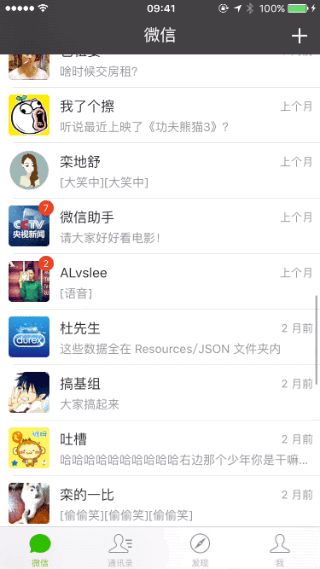
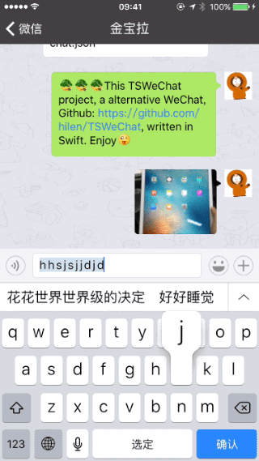

TSWeChat - A [WeChat](https://itunes.apple.com/cn/app/wei/id414478124) alternative, updated to Swift 5. &nbsp;&nbsp;&nbsp;&nbsp;&nbsp;&nbsp;[中文说明](Chinese_README.md)

## Requirements
- [Cocoapods](https://github.com/CocoaPods/CocoaPods) 1.2.0 +
- iOS 10.0+ / Mac OS X 10.9+
- Xcode 10.0+

## Features
- Send your rich text, expression, image and voice.
- The cell image in `TSChatImageCell` is drawn by using `Mask Layer` . The chat background can be changed freely so that UI will look perfect.
- Custom expression keyboard, custom tool keyboard.
- Audio `wav` files can be automatically converted into `amr` files which facilite file transfer to Android devices. Both of the two type files have been doing cache.
- When you tap the `TSChatVoiceCell`. It will automatically check the cache and download it by [Alamofire](https://github.com/Alamofire/Alamofire). 
- When you send the image, it will be stored locally by using the caching mechanism of [Kingfisher](https://github.com/onevcat/Kingfisher). After successfully uploaded, it will be automatically modified to image link's `MD5` value file name.
- The data are loaded from the JSON file. All the `Models` are created via [ObjectMapper](https://github.com/Hearst-DD/ObjectMapper) which is easy to convert model objects (classes and structs) from JSON.

## Preview
Run `pod install` in the `Terminal` and then run `TSWeChat.xcworkspace` to see all the views.  

## Directory

Directory name|Introduction
---|---
Classes| To deposit different folders like `ViewController`, `View`. Sub directories are divided based on business logic, Such as `Message`,`Address Book`,`Tabbar`,`Me`,`Login` and etc, divided according to their functions. 
Classes/CoreModule| To deposit encapsulation of business logic of basic classes, like HttpManager, Models, ApplicationManager and etc.
General|To deposit reused `View and Class` related with business logic, such as color extension.
Helpers|Non-business logic extension, such as: `UIView+Extension.swift`, `UIImage+Resize.swift` and etc.
Macro|To deposit macros and constant definitions used in the whole application, such as ` Notifications ` name , and  the third party librarie's keys.
Resources| Resources. Such as `Assets.xcassets`, `Media.xcassets`, `JSON files`, `media files`, `plist files` and etc.
Vendor| To deposit the third party liabraries that cannot be installed by `Cocoapods`.
Supporting Files| To deposit the original files
Scripts| APNs script, export IPA file script and etc.
Sketch| To deposit the original Sketch files. All the recourses in the project are come from the WeChat IPA folder, but some images I can't find. So I decided to do it myself. Yeah, I love design, sometimes coder become a designer is feeling good. XD

## Vendor
[See more details](https://github.com/hilen/TSWeChat/blob/master/Podfile)

## License
TSWeChat is released under the MIT license. See [LICENSE](https://github.com/hilen/TSWeChat/blob/master/LICENSE) for details.

## To Do
- The custom photo album
- WeChat custom ActionSheet
- Long press the chat cell
- The image viewer
- Address book
- GIF image cell in TSChatViewController
- QRCodeViewController
- ShakeViewController
- Send my address
- Video cell in TSChatViewController
- TimelineViewController
- Multilanguage support
- And so on...

##Contributing
- All kinds of contributions (enhancements, new features, documentation & code improvements, issues & bugs reporting & todo task) are welcome. Let's make it better. XD

##Contact
Follow and contact me on [Twitter](http://twitter.com/hilenlai) or [Sina Weibo](http://weibo.com/laihailong).

